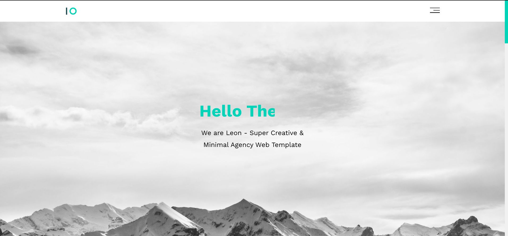
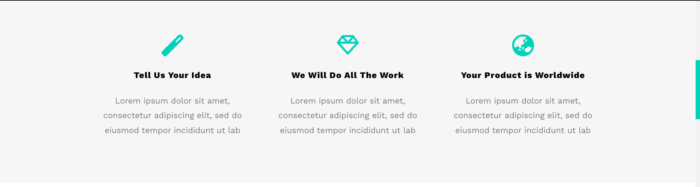
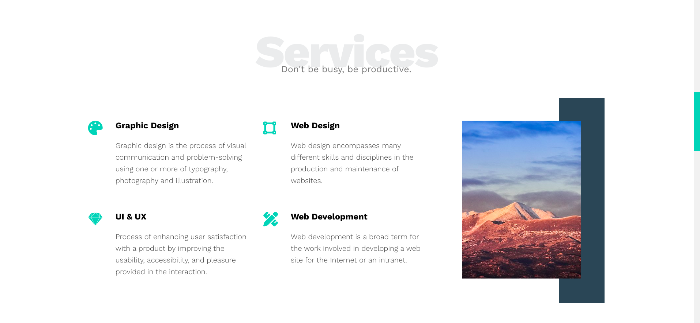
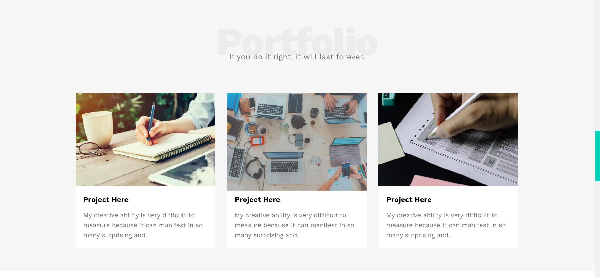
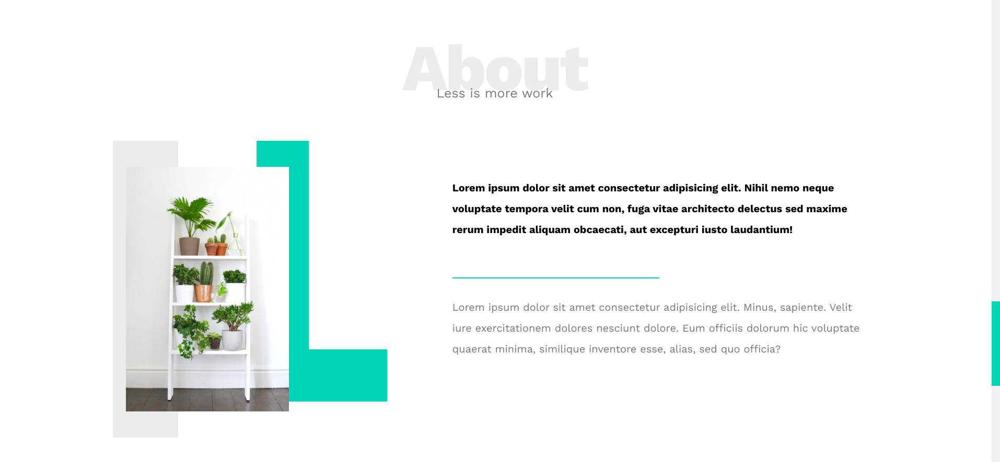
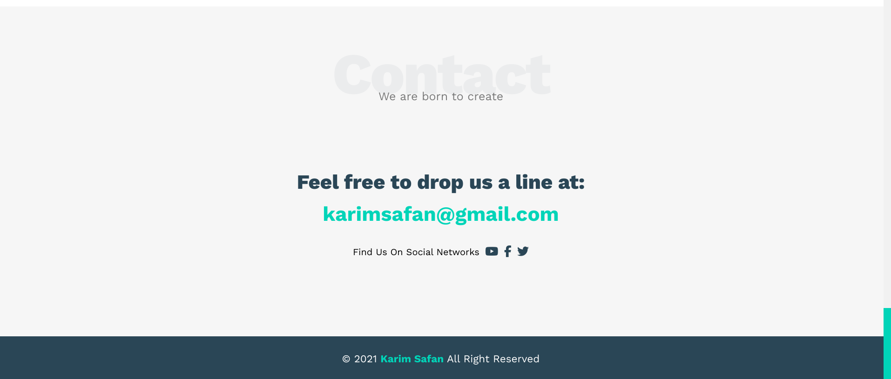

# My Responsive Website

## Overview
This is a responsive website project that I built using HTML, CSS, and popular libraries like FontAwesome and Normalize.css. The site is designed to be mobile-friendly and contains multiple sections with a custom scrolling experience.

## Features
- **Responsive Design**: The website is fully responsive, optimized for both mobile and desktop screens.
- **Custom Scrolling**: A custom scrolling effect has been implemented for a smoother navigation experience.
- **Multiple Sections**: The website includes various sections that display different types of content.
- **Icon Integration**: I used FontAwesome to easily include icons across the website.
- **CSS Reset**: Normalize.css is used to ensure consistent styling across different browsers.

## Technologies Used
- **HTML5**: Structure and content of the website.
- **CSS3**: Styling and layout of the website.
- **FontAwesome**: Icon library for visual elements.
- **Normalize.css**: CSS library to provide consistent cross-browser styling.

## CSS Responsive 
- **Grid Layout**: I am used grid system to make the design more responsive. 
- **Flexbox Layout**: Flexbox was utilized to efficiently structure and align elements within the layout.

> **Note**: You can open this template on your mobile screen.

## Demo
[Demo Link](https://karim1safan.github.io/Leon-Template-One/)

